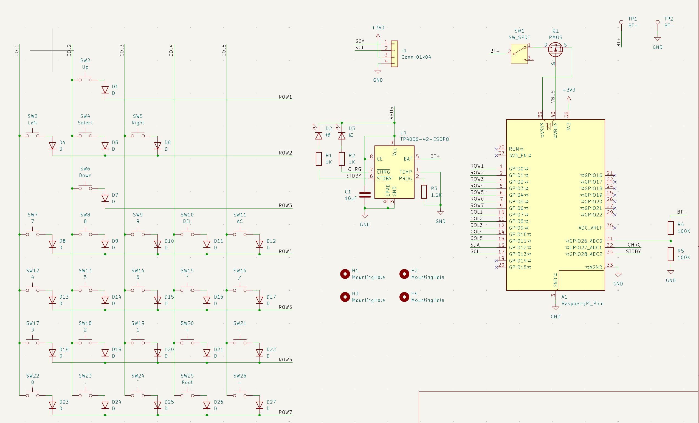
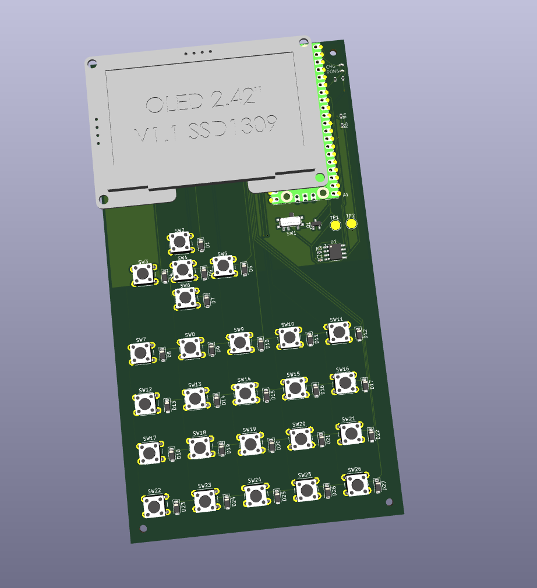

# totally a calculator
This is a RPi Pico powered...calculator...with an extensive library of..."extra apps" one could say.
The sole purpose of this project is to satisfy the ask of one of my classmates :sob:

## Images
Beautifully clean and organised (/s) schematic

## Cost
The BOM prices are approximate due to conversion rates and Aliexpress fluctuations
BOM: 27.03 USD
PCB: 4 USD + 1.5 USD shipping (approx)
Total: 32.53 USD