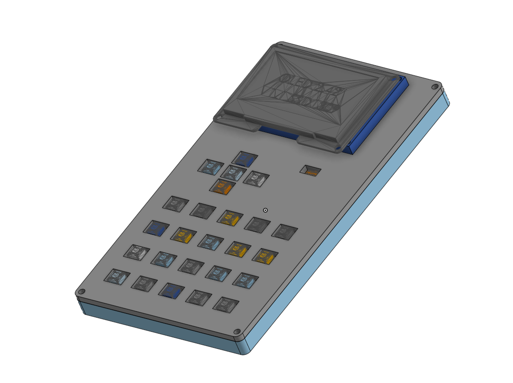
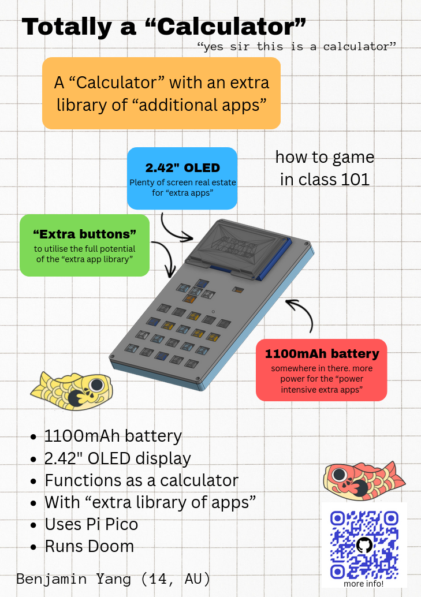

# totally a calculator
This is a RPi Pico powered...calculator...with an extensive library of..."extra apps" one could say.
The sole purpose of this project is to satisfy the ask of one of my classmates :sob:

[Onshape link](https://cad.onshape.com/documents/416f156d5c7fec03dfea0d3a/w/a37f3b67ee07a3cc1823a5f4/e/b4b6719643a130719caaa4b0)
Note: the display appears to be unaligned due to the fact that i used a different display to the model in the render. However, I designed the case around the display being used, so it should be fine.

## Repo structure
`firmware/` for the (not completed) firmware
`cad/` for CAD design files
`images/` for images in this readme
`pcb/` for KiCad design files and `pcb/gerbers` for production files
`bom.csv` for BOM

## Cost
The BOM prices are approximate due to conversion rates and Aliexpress fluctuations
BOM: 27.03 USD
PCB: 4 USD + 1.5 USD shipping (approx)
Total: 32.53 USD

## Assembly
Prerequisites: print the case parts and solder the PCB
1. Put PCB into bottom case
2. Screw top case onto bottom case
3. Glue or otherwise stick each individual keycap onto the buttons
4. Attach the OLED
5. Screw it in
6. Flash the MicroPython firmware for the Pico
7. Upload the python file in `firmware/`
8. yay

## Images

### Schematic
Beautifully clean and organised (/s) schematic

### PCB render

### Full render

### Zine
